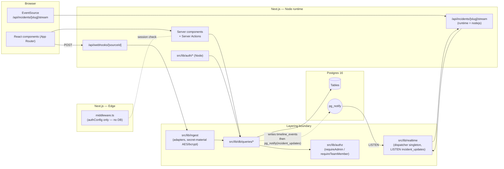
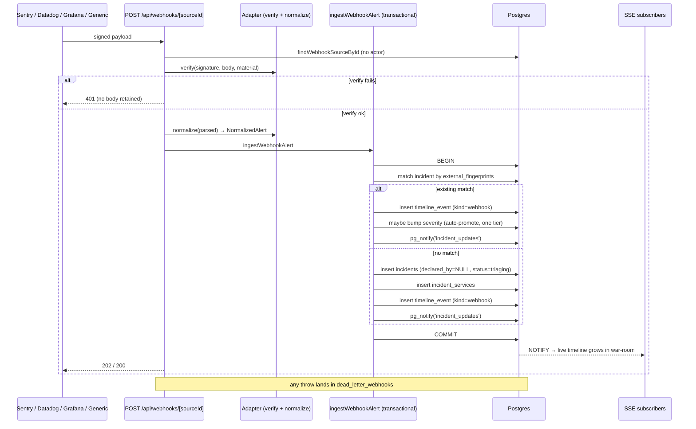

# incident_app

Web-first incident coordination tool for a single org with multiple teams. Declare incidents, run a war-room with a live timeline, ingest alerts from Sentry / Datadog / Grafana, publish a customer-facing status page, write postmortems, and look at MTTR / MTTA / frequency dashboards — all in one Next.js app backed by Postgres.

Full design spec: [`docs/superpowers/specs/2026-04-28-incident-tracker-design.md`](docs/superpowers/specs/2026-04-28-incident-tracker-design.md). Per-phase implementation plans live under [`docs/superpowers/plans/`](docs/superpowers/plans/).

## Stack

Next.js 16 (App Router) · TypeScript strict + `noUncheckedIndexedAccess` · Tailwind v4 (CSS-first) · Drizzle ORM 0.45 + Postgres 16 (docker-compose, port 5433) · NextAuth v5 beta with Edge/Node split · Vitest 4 + testcontainers (real Postgres, no DB mocks) · zod at every boundary · pnpm.

## What works today

| Plan | Capability | Notes |
|------|------------|-------|
| 1 — Foundation | SSO sign-in, org admin allowlist, teams + memberships, services, severity-keyed runbooks editor, sidebar shell | Plan 1 also defines the layering boundary: only `src/lib/db/queries/*` calls Drizzle. |
| 2 — Incidents core | Declare with severity / summary / affected services; chip-filtered list; per-incident detail page | Admin-sees-all parity across services & incidents. |
| 3 — Timeline + mutations | Notes (markdown), state-machine-guarded status changes, severity changes, role pickers (IC / Scribe / Comms) | Status leaving `triaging` requires an IC (except → `resolved`). |
| 4 — Real-time SSE | Postgres `LISTEN/NOTIFY` → Node-runtime SSE route → in-tab updates within ~1 s | Optimistic for notes only. Yellow "Reconnecting…" banner after 30 s of silence. |
| 5 — Postmortems | Per-incident editor, 800 ms-debounced autosave, action items rail, draft → published flow, "show on /status" toggle | Publishing emits a `postmortem_link` timeline event. |
| 6 — Webhook ingestion | `/api/webhooks/[sourceId]` for generic / Sentry / Datadog / Grafana | HMAC-SHA-256 (or bearer for Grafana), fingerprint-based match-or-create, auto-promote one tier max, dead-letter on failure. Triaging incidents created by webhook get the ⚠ unconfirmed tag and a "Dismiss as false positive" button. |
| 7 — Public status page | ISR-15 `/status`, `/status/[teamSlug]`, `/status/incidents/[slug]`, `/status/postmortems/[id]`, `/status/maintenance` | Per-team uptime over 30 days; only `status_update_published` events are public. |
| 8 — Metrics dashboard | `/dashboard` (4 stat cards + 3 panels) and `/metrics` (MTTR / MTTA line + frequency bar + severity donut + per-service heatmap) | recharts 2.x. MTTR excludes dismissed incidents; MTTA covers webhook-declared only. |

## Architecture

The app is a single Next.js process. The boundary lives at `src/lib/db/queries/*` — every route, server action, and server component reads/writes through it; nothing else imports Drizzle.



Key invariants:

- **Edge boundary.** `src/lib/auth/config.ts` and `src/middleware.ts` may not import `pg`, `postgres`, `drizzle-orm`, `node:*`, or `@/lib/db/*`. Enforced by an ESLint `no-restricted-imports` rule.
- **Authz at the data layer.** Queries call `requireAdmin` / `requireTeamMember`; routes do not re-implement authorization. Public `/status/*` is the one explicit exception (middleware matcher excludes it).
- **Atomic timeline writes.** Every mutation that changes incident state writes its `timeline_events` row inside `db.transaction(...)` and emits `pg_notify('incident_updates', …)` from the same tx. Notify queues until commit, so SSE viewers only see committed state.
- **Webhook ingest is transactional too.** Match-or-create + auto-promote check + every event insert + `notifyIncidentUpdate` all run inside one `db.transaction`. Dead-letters get a row in `dead_letter_webhooks` on adapter throw or tx blowup.
- **Optimistic UI is notes-only** (per spec §8.1). Status / severity / role mutations stay confirmed-only.

### Auth flow (offline mode and Google)

```mermaid
sequenceDiagram
    actor U as User
    participant Page as /signin
    participant NA as NextAuth (Node)
    participant P as provisionUserOnSignIn
    participant DB as Postgres
    Note over Page,NA: AUTH_PROVIDER=dev — Credentials provider<br/>AUTH_PROVIDER=google — Google OIDC

    U->>Page: open /signin
    alt dev mode
        Page-->>U: email input form
        U->>Page: submit email
        Page->>NA: signIn('credentials', {email})
        NA->>NA: authorize returns id, email, name, role=member
    else google mode
        Page->>NA: signIn('google')
        NA->>U: redirect to Google
        U->>NA: OIDC callback
    end
    NA->>P: signIn callback with email + providerAccountId
    P->>DB: INSERT users ON CONFLICT email DO UPDATE
    P-->>NA: id + role (role from ADMIN_EMAILS)
    NA->>NA: jwt stores userId+role; session projects them
    NA-->>U: cookie set, redirect /dashboard
```

The same `provisionUserOnSignIn` runs in both modes, so `ADMIN_EMAILS` is the single switch that decides who becomes admin on first sign-in. Role transitions after first sign-in go through the admin UI — `provisionUserOnSignIn` intentionally omits `role` from its `ON CONFLICT DO UPDATE SET` so re-login can never demote you.

### Webhook ingest flow



## Local setup

There are two paths. Pick one.

### Path A — 100% offline (recommended for testing)

No Google OAuth client, no internet (after `pnpm install`), no signed-in identity needed. Runs against the local Postgres container.

```bash
cp .env.example .env.local           # ships with AUTH_PROVIDER=dev pre-set

# Generate AUTH_SECRET (any 32-byte string works; use the snippet below):
node -e "console.log(require('crypto').randomBytes(32).toString('base64'))"
# Paste it into AUTH_SECRET= in .env.local.

# (optional) Edit ADMIN_EMAILS in .env.local to change which dev email becomes admin.
# Default is dev-admin@local.

pnpm install
pnpm db:up         # boot Postgres 16 container on port 5433
pnpm db:migrate    # apply 8 migrations
pnpm db:seed       # one Personal team, two services, a SEV2 runbook, an admin
pnpm dev           # http://localhost:3000
```

On `/signin` you'll see a single email input. Submitting it provisions (or re-finds) a user, sets the session cookie, and lands you on `/dashboard`. Type `dev-admin@local` to land as admin; type any other address to land as a member with no team — useful for testing the admin-vs-member branches in queries.

### Path B — Google OIDC

```bash
cp .env.example .env.local
# Set AUTH_PROVIDER=google
# Generate AUTH_SECRET as above

# Wire Google OAuth at https://console.cloud.google.com/apis/credentials :
#   - OAuth client (Web application)
#   - Authorized redirect URI: http://localhost:3000/api/auth/callback/google
# Paste client ID + secret into .env.local.

# Add your Google email to ADMIN_EMAILS so first sign-in promotes you.

pnpm install
pnpm db:up
pnpm db:migrate
pnpm db:seed       # optional in this mode — Google sign-in alone is enough to provision a user
pnpm dev
```

### Reset the local database

```bash
pnpm db:down                          # stop container
docker volume rm incident_app_pg      # nuke the volume
pnpm db:up && pnpm db:migrate && pnpm db:seed
```

## Quality gates

```bash
pnpm typecheck     # tsc --noEmit
pnpm lint          # eslint .
pnpm format:check  # prettier --check .
pnpm test          # vitest run — 352 tests, ~28 s with one shared testcontainer
pnpm build         # next build
```

Integration tests use real Postgres via testcontainers. **No DB mocks anywhere in the codebase.** A single container is booted in `tests/setup/global.ts` and reused across all integration files; per-test isolation is via `TRUNCATE` (`tests/setup/withTx.ts:useTestDb`). `vitest.config.ts` carries `fileParallelism: false` because TRUNCATE-per-test is incompatible with parallel files against a shared schema.

## Layout

```
src/
  app/
    (app)/                   ← auth-walled routes (incidents, services, settings, dashboard, metrics)
    (auth)/                  ← /signin
    (public)/                ← /status/* (no session required)
    api/
      auth/                  ← NextAuth handlers
      incidents/[slug]/stream/ ← SSE route, runtime = nodejs
      postmortems/[id]/      ← autosave POST
      webhooks/[sourceId]/   ← public ingest
  lib/
    auth/                    ← Edge config + Node providers + provisionUserOnSignIn
    authz/                   ← requireAdmin / requireTeamMember / ForbiddenError
    db/queries/              ← only place that calls Drizzle
    db/schema/               ← Drizzle pgTable definitions
    incidents/               ← slug minting
    ingest/                  ← adapters + secret-material AES/bcrypt
    metrics/                 ← pure aggregators + range parser
    realtime/                ← dispatcher singleton, NOTIFY payload schema
    postmortems/             ← editor template
    status/                  ← snapshot builder + 30-day uptime
    timeline/                ← jsonb body schema (zod discriminated union)
  middleware.ts              ← Edge auth gate (matcher excludes /status/**)
  components/shell/          ← Sidebar + Header (Sidebar is client for active-link styling)

drizzle/                     ← generated SQL migrations (forward-only, 0000–0007)
tests/integration/           ← Vitest + testcontainers
tests/setup/                 ← global container, useTestDb / getTestDb / expectDbError
scripts/seed.ts              ← idempotent dev seed
docs/superpowers/            ← spec + per-phase plans (canonical project docs)
```

## Acceptance checklist

After `pnpm dev` against the offline path:

1. [ ] Visit `http://localhost:3000` → redirected to `/signin`.
2. [ ] Submit `dev-admin@local`. Land on `/dashboard`.
3. [ ] Sidebar shows: Dashboard, Incidents, Services, Metrics, Settings.
4. [ ] `/services` lists `checkout-api` and `auth-service` (from the seed).
5. [ ] Click `checkout-api` → SEV2 tab shows the seeded runbook.
6. [ ] `/incidents` is empty. Click **Declare incident**, set title `Login latency`, severity SEV2, attach `checkout-api`, submit.
7. [ ] Land on `/incidents/inc-XXXXXXXX`. Pills show SEV2 / triaging. The SEV2 runbook for `checkout-api` is visible.
8. [ ] Post a markdown note via the Timeline form — appears in the timeline.
9. [ ] Try to move to `investigating` without an IC — blocked. Pick an IC under Roles → status now moves.
10. [ ] Open the same incident in a second browser tab. Post a note in tab 1 — appears in tab 2 within ~1 s without a refresh.
11. [ ] In tab 2's network panel, `/api/incidents/<slug>/stream` stays open and emits `event: heartbeat` every 25 s.
12. [ ] Resolve the incident. Click **Postmortem** in the right rail → land on the editor with the 5-section template (Summary / Timeline / Root cause / What went well / What didn't).
13. [ ] Edit any field — within 800 ms the autosave indicator flips through *Saving…* → *Saved*. Reload — text persists.
14. [ ] Toggle **Show on /status** ON, then click **Publish**. A `postmortem_link` event appears in the war-room timeline.
15. [ ] Visit `/status` (no auth needed) → uptime card + an entry for the resolved incident. Visit `/status/postmortems/<id>` → the published postmortem.
16. [ ] Visit `/dashboard` and `/metrics` — stat cards populate; the MTTR/MTTA chart shows a single point if you have a resolved incident.
17. [ ] Sign out (top-right) → redirected to `/signin`. Sign back in as `member@example.com` (or any non-admin). Settings link in the sidebar is hidden. `/incidents` is empty (you're not on any team).

### Webhook smoke test

```bash
# 1. As admin, create a generic webhook source at /settings/webhooks. Note the URL + secret.
SOURCE_URL="<copied URL>"
SECRET="<copied secret>"

# 2. Send a signed payload.
BODY='{"title":"Smoke test","fingerprint":"smoke-1","severity":"SEV3","services":[]}'
SIG=$(printf '%s' "$BODY" | openssl dgst -sha256 -hmac "$SECRET" -hex | awk '{print $2}')
curl -sS -X POST -H "Content-Type: application/json" \
  -H "X-Signature: sha256=$SIG" \
  -d "$BODY" "$SOURCE_URL"

# 3. /incidents shows a triaging row with the ⚠ unconfirmed tag.
# 4. Re-fire the same payload twice more within 10 minutes — the third call bumps severity to SEV2 and emits a severity_change event.
# 5. On the war-room, click "Dismiss as false positive". Status flips to resolved with a "Dismissed as false positive" line.
```

## Deferred follow-ups

A list of code-review findings deferred to a v1.1 cleanup pass lives at [`.claude/memory/foundation_followups.md`](.claude/memory/foundation_followups.md). Highlights:

- Rename `middleware.ts` → `proxy.ts` (Next 16 deprecation warning).
- End-to-end auth chain test (signIn → jwt → session).
- Server Action error UX via `useFormState` (currently throws fall through to `error.tsx`).
- `users.email` citext or `lower()` CHECK.
- `AdapterUser` type augmentation to drop the `(user as ...).role` casts in auth.
- Real-time `revalidatePath('/status')` from a long-lived listener (v1 uses ISR=15).
- Per-source rate limiting + payload size cap on `/api/webhooks/[sourceId]`.

Address these before any production rollout.

## License suggestion

If your goal is "free to use, modify, and share" with minimal friction and no commercial restriction, use the **MIT License**.

Why MIT is a strong fit here:

- Very permissive and widely understood.
- Allows personal, educational, and commercial use.
- Keeps attribution/disclaimer requirements simple.
- Maximizes adoption and contributions.

If you want to waive even more rights and push this close to public domain, consider **CC0-1.0** instead.
