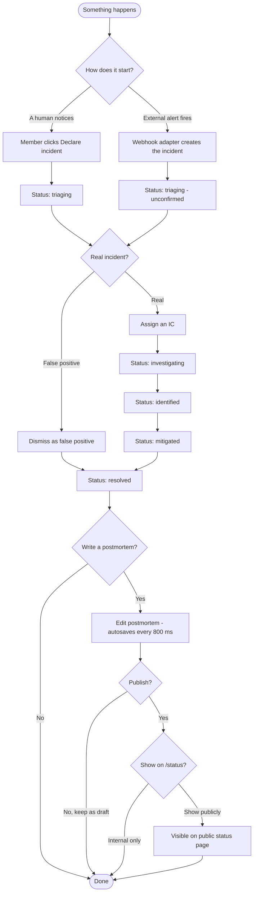
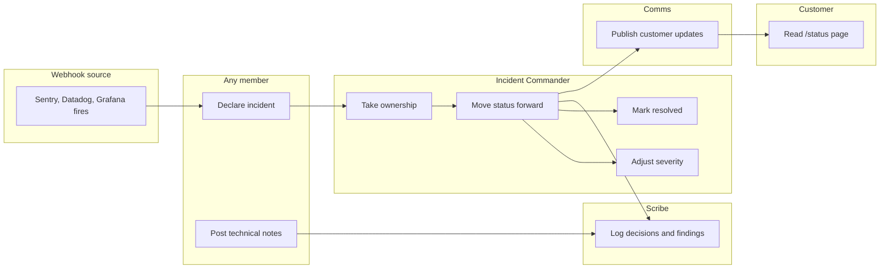
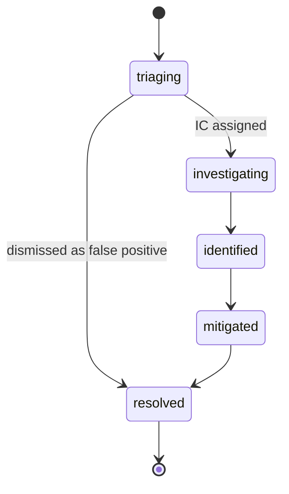

# User Guide — How the app works

A walkthrough of the day-to-day flow: who declares an incident, who runs the response, how the timeline works, what shows up on the public status page, and what becomes a postmortem. Written for end users (responders, on-callers, communicators) — not for developers maintaining the codebase.

For the architecture, setup, and developer-facing material see [`README.md`](README.md). For the formal product spec see [`docs/superpowers/specs/2026-04-28-incident-tracker-design.md`](docs/superpowers/specs/2026-04-28-incident-tracker-design.md).

---

## TL;DR

- An **incident** is anything you want to coordinate a response around — a real outage, a noisy alert, a degraded latency.
- It has **two role layers**: the **org role** (`admin` or `member`) controls what you see across teams; the **incident role** (`IC`, `Scribe`, `Comms`) controls who does what during the response.
- An incident moves through six statuses: `triaging → investigating → identified → mitigated → resolved`, with `dismissed` as a shortcut for false-positives from triaging.
- The **war-room page** is where everything happens during the response. It updates live across browser tabs.
- Once `resolved`, you can write a **postmortem** (auto-saved while you type) and optionally publish it on the public **`/status`** page along with customer-facing updates.

---

## The roles

There are **two independent role layers**. Don't confuse them.

### Organization roles

| Role | Sees | Configures |
|---|---|---|
| **Admin** | Every team, every service, every incident, every metric. | Teams, memberships, services owned by any team, webhook sources, dashboard scope. |
| **Member** | Only the teams they belong to (and the services + incidents owned by those teams). | Services owned by their team. Can declare incidents. Cannot manage memberships. |

You become admin on first sign-in if your email is in the `ADMIN_EMAILS` config. Promotion to admin after first sign-in is done by an existing admin via `/settings/teams`.

### Incident roles

Assigned per-incident in the war-room's right rail. Same person can hold more than one. None of these are "users with permission" — they're labels on the incident saying who's accountable for what during this specific event.

| Role | Responsibility |
|---|---|
| **IC** (Incident Commander) | Owns the response. Authorizes status changes and severity changes. **Required** to leave `triaging` (except when going straight to `resolved`). |
| **Scribe** | Keeps the timeline honest. Posts notes describing what was tried, what was found, what was decided. |
| **Comms** | Talks to the outside world. Writes the customer-facing updates that show up on `/status`. |

In a small team one person plays all three. The system only enforces "must have an IC to leave triaging".

---

## Incident lifecycle

The five "real" statuses (`investigating → identified → mitigated → resolved`) are a soft script: not every incident hits all four. The state machine just blocks invalid transitions (you can't jump backwards to `triaging` once you've left it, and you can't skip past statuses — the UI hides invalid options).

---

## Who does what

A swimlane view — each lane is a role, each box is an action. Arrows show typical handoffs.

The roles you'll see in the war-room's right rail: IC, Scribe, Comms. Anybody on the team can post notes; the role labels are about ownership, not permission.

---

## Status state machine

`dismissed` is a flag on a `resolved` incident, not a separate status — it's how the metrics page knows to exclude the incident from MTTR calculations.

---

## Setup, one-time (admin)

Before you can declare a single incident, an admin needs to do this once:

1. **Create teams** at `/settings/teams`. Each team is an organizational unit (e.g., `payments`, `auth-platform`). Add members with role `lead` or `member`.
2. **Create services** at `/services`. A service is a thing that can break — usually a microservice or a customer-facing surface. Each service belongs to one team.
3. **Write runbooks** on each service. Each service has four severity-keyed tabs (SEV1 / SEV2 / SEV3 / SEV4); each tab is a markdown editor where you write what to do if this service goes down at this severity. These show up automatically inside any incident that affects this service.
4. **(Optional) Connect external alerters** at `/settings/webhooks`. Pick a provider (generic / Sentry / Datadog / Grafana), give it a name, copy the URL + secret into the alerter's outbound config. Now alerts from that provider open incidents automatically.

Day-to-day, all of this stays put. New services and runbooks are added as the org grows; webhook sources are usually a write-once decision.

---

## Step by step

### 1. Declaring an incident

Two ways:

**Manual** — anyone on a team clicks **Declare incident** on `/incidents`. Fills:

- **Title** — short and human (`Login latency`, `Checkout 5xx spike`).
- **Severity** — SEV1 (catastrophic) → SEV4 (cosmetic).
- **Summary** — one or two sentences of context.
- **Affected services** — pick from the dropdown (only your team's services).

Submit → you land on a brand-new war-room at `/incidents/inc-XXXXXXXX` in status `triaging`.

**Automatic (webhook)** — Sentry/Datadog/Grafana fires. The adapter checks if there's already an open incident with the same fingerprint (e.g., same Sentry issue ID). If yes, it **annotates** that incident's timeline with a `webhook` event. If no, it **creates a new incident** in `triaging` with `declared_by = (auto-fired)`. The `/incidents` list shows a ⚠ **unconfirmed** tag on these so a human can decide whether to triage or dismiss.

If the same webhook fingerprint fires N times in X minutes (configured per source), the incident's severity **auto-promotes one tier** (e.g., SEV3 → SEV2). At most once per incident.

### 2. Triaging

Every incident starts in `triaging`. A human needs to look at it.

Three exits:

| Decision | What you do | Result |
|---|---|---|
| Real incident | Assign an **IC** in the right rail, then move to `investigating`. Without an IC the system blocks the transition. | Status moves; war-room becomes "live response mode". |
| False positive | Click **Dismiss as false positive** on the war-room. | Status jumps to `resolved` with a `Dismissed as false positive` note. Excluded from MTTR. |
| Self-healed before triage | Move directly to `resolved`. | Counts as a real incident in MTTR. |

### 3. The war-room

The war-room is the single page where the incident response runs. Three regions:

**Top header** — title, severity pill, status pill, who declared it, age (live-ticking duration), affected services. The runbooks for those services render inline at the matching severity, so the responder doesn't need to open another tab to find them.

**Center column — Timeline.** Every state-changing action becomes an event. Sorted oldest-first. Event kinds:

- 📝 **Note** — markdown body. Bullets, links, code, all rendered.
- 🔄 **Status change** — `triaging → investigating`, etc.
- ⚠️ **Severity change** — SEV3 → SEV2, etc.
- 👤 **Role change** — "Diogo took IC", "Maria took Comms".
- 🔔 **Webhook** — alerter fired again; shows source name + count.
- 📰 **Status update published** — Comms posted a customer-facing update.
- 🔗 **Postmortem published** — clickable link to the postmortem doc.

The timeline updates **live**: open the same incident in two browser tabs, post a note in tab 1, and tab 2 grows the event in ~1 second without a refresh. If the live connection drops, a yellow `Reconnecting…` banner appears after 30 seconds.

**Right rail — Controls.** This is where you act on the incident:

| Control | Who uses it | What it does |
|---|---|---|
| Note form | Anyone | Posts a markdown note to the timeline. Optimistic — appears instantly, reconciles when the server confirms. |
| Status control | Typically the IC | Moves the status forward. Hides invalid transitions. Asks for an IC if you don't have one yet. |
| Severity control | Typically the IC | Re-classifies severity. |
| Role pickers | Anyone (often the IC) | Three dropdowns: IC, Scribe, Comms. List members of the incident's team. |
| Postmortem trigger | Anyone, after `resolved` | Opens the postmortem editor. |
| Public update form | IC / Scribe / Comms / admin | Posts a customer-visible update to `/status`. |

### 4. Resolving

When the IC decides it's over, they move status to `resolved`. The duration timer stops. The incident leaves the "open" filter on `/incidents` but is fully searchable later.

### 5. Postmortem

After `resolved`, anyone on the team can click **Postmortem** in the right rail. The editor opens at `/incidents/[slug]/postmortem` with a five-section template:

1. Summary
2. Timeline
3. Root cause
4. What went well
5. What didn't

Edit freely; **autosave** runs every 800 ms (you'll see `Saving… → Saved` in the corner). The right side has an **action items** rail — each item gets a title, optional description, owner, due date, and a link to an external ticket. Action items live independently of the postmortem text.

Two flags, **independent** of each other:

- **Publish** — flips the doc from `draft` to `published`. Once published, a `postmortem_link` event lands on the war-room timeline.
- **Show on `/status`** — controls whether the published postmortem also appears on the public status page. You can publish internally without making it public.

### 6. Public status page

Anyone — no login — can hit `/status`. They see:

- **Per-team uptime** over the last 30 days (weighted: SEV1/2 count fully, SEV3 half, SEV4 zero).
- **Active incidents** — but only those with at least one **`status_update_published`** event. Incidents the team is silently triaging are NOT exposed. Internal notes are NEVER exposed.
- **Recently resolved incidents** with their public updates.
- **Postmortems** that were both published AND have the "show on /status" flag set.

`/status/<team-slug>` is the same view filtered to one team. `/status/incidents/<slug>` is the public view of one incident — only the public updates, not the internal notes. The page revalidates every 15 seconds.

### 7. Metrics

Two pages:

- **`/dashboard`** — quick big-picture view. Four counters (open / triaging unconfirmed / resolved this week / MTTR this week) plus three lists.
- **`/metrics`** — analytical view with five charts:
  - **MTTR** — Mean Time To Resolve, plotted over the selected range. Excludes dismissed false-positives.
  - **MTTA** — Mean Time To Acknowledge, only for webhook-declared incidents (measures: how long until a human took ownership of an auto-fired alert).
  - **Frequency** — stacked bar by severity over time.
  - **Severity mix** — donut of SEV1/2/3/4 distribution.
  - **Service heatmap** — last 7 days, which services had the most incidents.

A range selector at the top of `/metrics` switches between 7d / 30d / 90d / custom. Members see only their teams; admins see everything by default and can narrow with `?team=<uuid>`.

---

## Who does what — quick reference

| Question | Answer |
|---|---|
| Who **declares** an incident? | Any member of an affected team (manually) or a connected webhook source (automatically). |
| Who **watches** during the response? | Everyone on the team that owns the incident, plus all admins. The war-room updates live. |
| Who **leads** the response? | The **IC**, set in the right rail. Without an IC the status is stuck in `triaging`. |
| Who **records** what happened? | Typically the **Scribe**, via timeline notes. Anyone on the team can post a note. |
| Who **talks to customers**? | The **Comms** role (or IC / admin). Public updates show up on `/status`. |
| Who **writes the postmortem**? | Anyone on the team, after `resolved`. Auto-saves while editing. |
| Who **dismisses a false positive**? | Anyone on the team, only while in `triaging`. |
| Who **sees metrics**? | Members see their teams; admins see everything (and can filter by team). |

---

## Quick FAQ

**Can I edit a note after posting it?** No — notes are append-only. If you got something wrong, post a follow-up note.

**Can I change the affected services after declaring?** Not in v1. If you need a service added, declare a sibling incident or note it in the timeline.

**Why is the war-room not updating?** Look for the yellow `Reconnecting…` banner. The page falls back to revalidating on every action even if SSE is down. Worst case, refresh.

**Why can't I leave triaging?** Either you haven't picked an IC, or the system thinks the next status is invalid. If you genuinely can't escalate, dismiss as false positive (if applicable) or assign yourself IC and move forward.

**Why doesn't my incident appear on `/status`?** Because nobody has used the **Public update form** yet. Internal incidents are never auto-public; Comms (or IC/admin) has to publish at least one update.

**Why does MTTR look low?** Dismissed false-positives don't count. If your team gets a lot of webhook noise, dismissing it keeps the metric meaningful.
